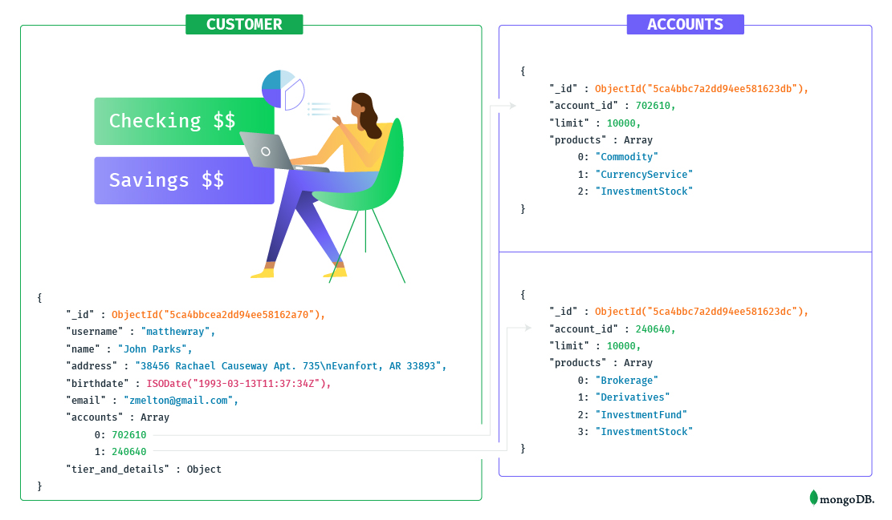
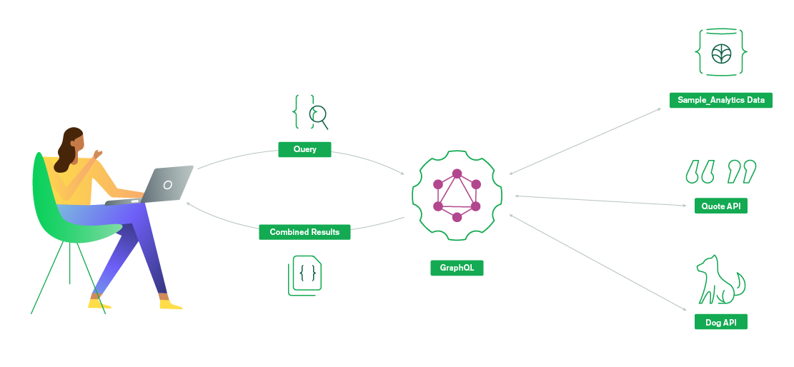
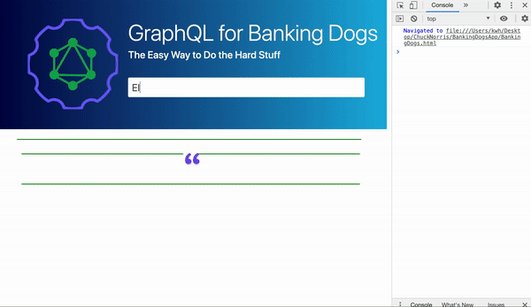

# GraphQL: The Easy Way to Do the Hard Stuff
GraphQL is rapidly growing in popularity as the new standard for working with APIs, and it's easy to see why! 
Performant and efficient, this groundbreaking API query language gives developers a single API endpoint to access exactly the data they need. 

*This web application provides the front-end for the BankingDogs application built in the Realm GraphQL tutorial published on the MongoDB DevHub.* 

In it, we take the **sample_analytics** dataset and set up a hosted, serverless, and secure GraphQL API for our data in minutes. 

  

Then we will extend that API with GraphQL **relationships** to other data collections and **custom resolvers** in order to bundle together different data sources and APIs together under the same schema. 

  

Finally, we will build out a web application using our GraphQL endpoint to demonstrate how GraphQL gives us exactly the data we want- nothing more, nothing less.

  

With such extensibility, you can iterate even more quickly on frontend features your application users will love.

*A video walk-through of the application and features is here: https://youtu.be/nM51I6XVlTw*
